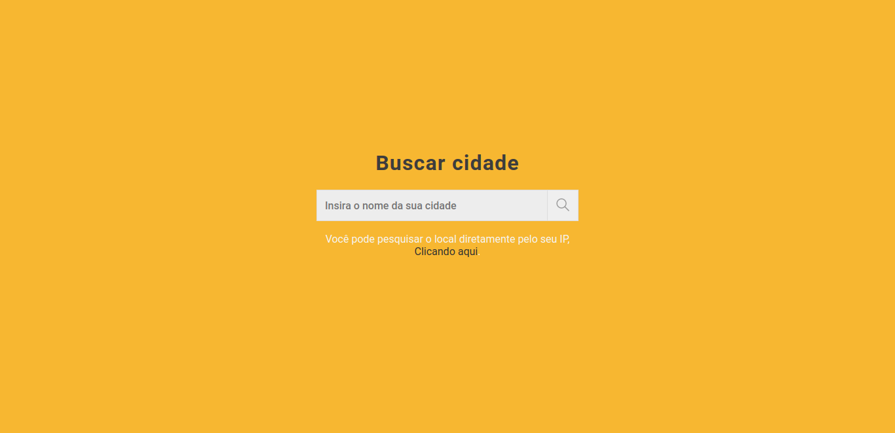
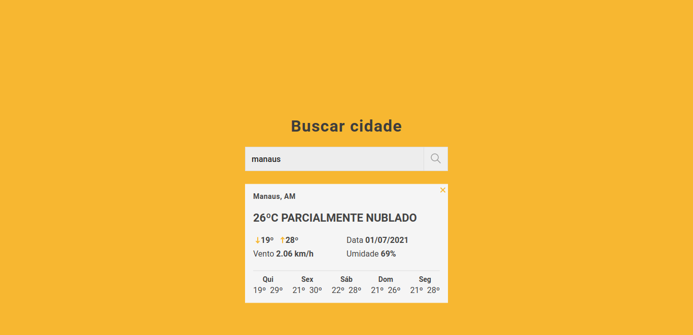

<h1 align="center"> watchtime</h1>

Um site para ver a previsão do tempo na sua cidade(Limitado ao Brasil ). <a href="https://lucasfernandodev.github.io/watchtime/">Clique aqui</a> e veja como o site ficou, a API usada nesse projeto é a <a href="https://console.hgbrasil.com/documentation/weather">HG Weather</a>.

